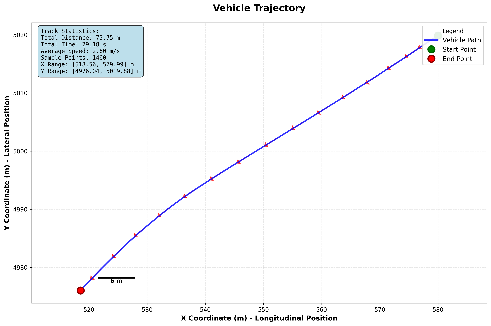
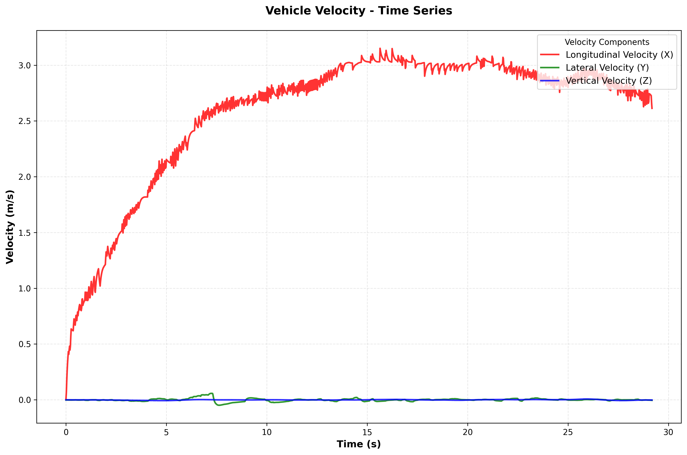
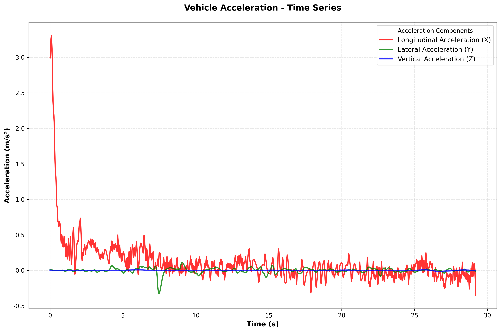
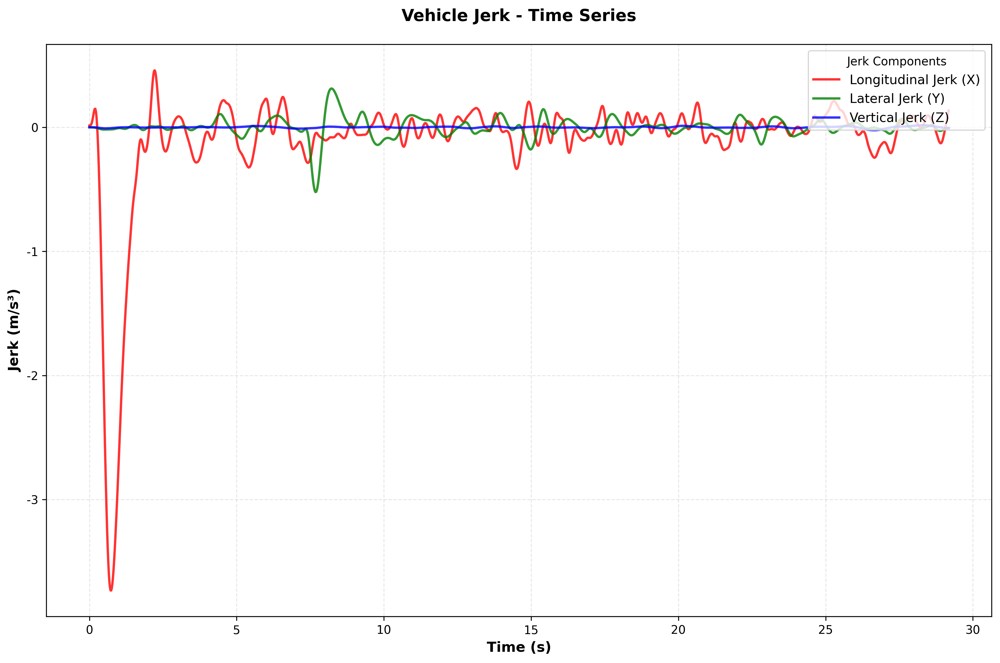
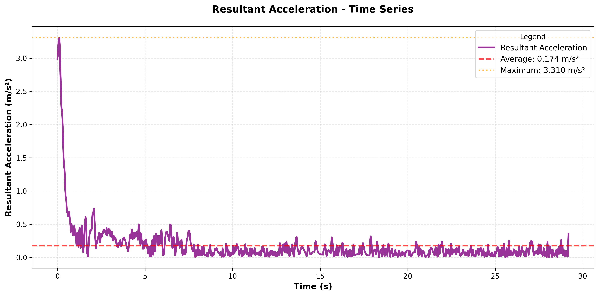
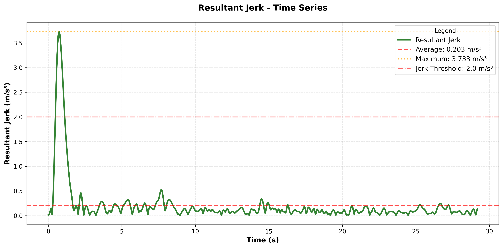
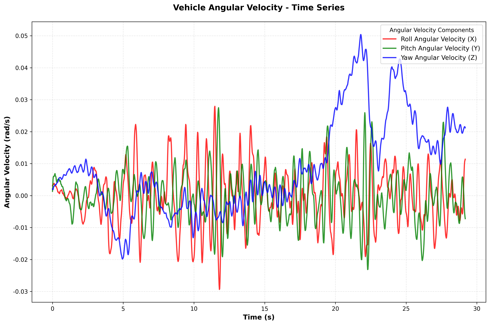
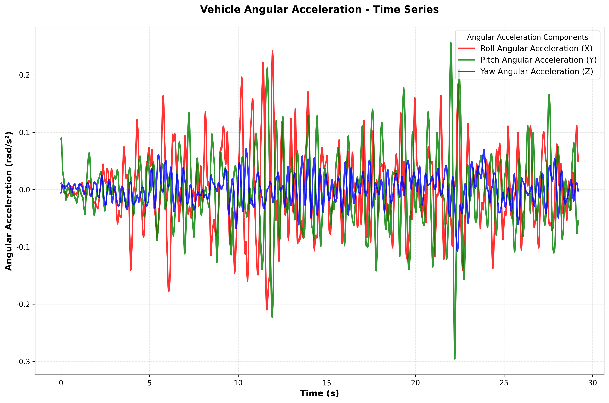

# C798_LS6BME2P4SA718595_2024-10-13_14-32-40 优化后舒适度评价报告

## 🎯 总体评价结果

### 评价概要

| 评价指标 | 评分结果 |
|---------|---------|
| **RFS总分** | **86.1/100** |
| **舒适度等级** | **优秀** |
| **评价时间** | 2025-10-24 16:13:39 |

### 评分等级说明

| RFS评分 | 舒适度等级 | 评价说明 |
|---------|------------|----------|
| 90-100 | 卓越 | 极佳的乘坐体验，各项指标均达优秀水平 |
| 80-89 | 优秀 | 良好的乘坐舒适度，个别指标有优化空间 |
| 70-79 | 良好 | 可接受的舒适度水平，存在改进需求 |
| 60-69 | 合格 | 基本的舒适度要求，需要针对性优化 |
| <60 | 有待改进 | 舒适度较差，需要系统性的改进措施 |

---

## 📈 舒适度提升建议

### 总体建议

**当前水平: 良好**

当前车辆的乘坐舒适度表现良好，仍有优化空间。建议关注个别指标的改进，以进一步提升整体乘坐体验。

### 针对性改进建议

#### 瞬时冲击改进建议

**问题识别:** 加速度峰值过高 (1.283 m/s²)

**改进措施:** 优化动力总成悬置系统，改善传动系统平顺性，调整油门响应特性，减少突然的加减速冲击。

#### 巡航平稳性改进建议

**问题识别:** 巡航占比过低 (10.0%)

**改进措施:** 改善动力系统稳定性，优化控制参数，减少不必要的状态切换和调整。

---

## 📋 详细分析报告

### 报告信息

- **评价标准**: RFS舒适度评价标准（经验调整版 + 真正的频率加权）
- **基于标准**: ISO 2631-1:1997 Wk/Wd频率加权 + 工程经验
- **评价时长**: 29.20 秒

---

## 车辆轨迹图

车辆轨迹图已保存至: rfs_evaluation_output_optimized_20241013/trajectory.png

## 运动参数图表

### Velocity Time Series

### Acceleration Time Series

### Jerk Time Series

### Resultant Acceleration

### Resultant Jerk

### Angular Velocity Time Series

### Angular Acceleration Time Series

## 运动参数统计

### 轨迹统计
- **总里程**: 75.75 m
- **起点坐标**: (579.99, 5019.88, -4.66)
- **终点坐标**: (518.56, 4976.04, -4.66)
- **行驶时间**: 29.18 s
- **平均速度**: 2.60 m/s

### 速度统计 (m/s)

| 轴向 | 平均值 | 最大值 | 最小值 |
|------|--------|--------|--------|
| X轴(纵向) | 2.588 | 3.151 | 0.006 |
| Y轴(横向) | -0.001 | 0.057 | -0.049 |
| Z轴(垂直) | -0.001 | 0.007 | -0.008 |

### 加速度统计 (m/s²)

| 轴向 | 平均值 | 最大值 | 最小值 | RMS值 |
|------|--------|--------|--------|-------|
| X轴(纵向) | 0.110 | 3.310 | -0.356 | 0.357 |
| Y轴(横向) | 0.000 | 0.113 | -0.323 | 0.038 |
| Z轴(垂直) | -0.000 | 0.008 | -0.012 | 0.003 |

### 急动度统计 (m/s³)

| 轴向 | 平均值 | 最大值 | 最小值 | RMS值 |
|------|--------|--------|--------|-------|
| X轴(纵向) | -0.105 | 0.458 | -3.733 | 0.505 |
| Y轴(横向) | -0.001 | 0.313 | -0.522 | 0.078 |
| Z轴(垂直) | -0.000 | 0.017 | -0.024 | 0.006 |

### 角速度统计 (rad/s)

| 轴向 | 平均值 | 最大值 | 最小值 | RMS值 |
|------|--------|--------|--------|-------|
| X轴(横滚) | -0.0002 | 0.0279 | -0.0294 | 0.0089 |
| Y轴(俯仰) | 0.0001 | 0.0275 | -0.0231 | 0.0078 |
| Z轴(偏航) | 0.0087 | 0.0504 | -0.0198 | 0.0172 |

### 角加速度统计 (rad/s²)

| 轴向 | 平均值 | 最大值 | 最小值 | RMS值 |
|------|--------|--------|--------|-------|
| X轴(横滚) | 0.0002 | 0.2425 | -0.2098 | 0.0686 |
| Y轴(俯仰) | -0.0000 | 0.2560 | -0.2956 | 0.0658 |
| Z轴(偏航) | 0.0006 | 0.0710 | -0.1075 | 0.0245 |

---

## RFS乘坐舒适度评价结果

### 总体评价

| 指标 | 评分 |
|------|------|
| **RFS总分** | **86.1/100** |
| **舒适度等级** | **优秀** |

### 评价权重分配

| 评价维度 | 权重 | 说明 |
|----------|------|------|
| 持续振动 | 30% | 基于工程经验调整 |
| 瞬时冲击 | 25% | 基于工程经验调整 |
| 运动平顺性 | 30% | 基于工程经验调整 |
| 角运动舒适性 | 10% | 基于工程经验调整 |
| 巡航平稳性 | 5% | 基于工程经验调整 |

### 详细评价结果

#### 持续振动 (权重: 30%)

**得分: 100.0/100**

- 总加权加速度值 a_v: 0.0606 m/s²
- 说明: ISO 2631-1 Wk/Wd频率加权 + 经验调整

#### 瞬时冲击 (权重: 25%)

**得分: 61.6/100**

- 加速度峰值 A_peak: 1.2832 m/s²
- 急动度RMS Jerk_rms: 0.5111 m/s³

#### 运动平顺性 (权重: 30%)

**得分: 92.0/100**

- 急动度峰值 Jerk_peak: 0.2702 m/s³
- 急动度超限事件数: 44 次 (3.01%)

#### 角运动舒适性 (权重: 10%)

**得分: 100.0/100**

- 角速度RMS ω_rms: 0.0209 rad/s
- 角加速度峰值 α_peak: 0.1305 rad/s²

#### 巡航平稳性 (权重: 5%)

**得分: 62.6/100**

- 巡航速度标准差 σ_v: 0.0500 m/s
- 巡航占比 R_c: 10.0%

---

## 评分标准说明

### ISO 2631-1频率加权

- **Z轴(垂直振动)**: Wk filter (垂直振动)
- **X/Y轴(水平振动)**: Wd filter (水平振动)
- **实现方式**: True frequency domain weighting with FFT + Experience-based adjustments

### 舒适度等级标准

| RFS评分 | 舒适度等级 | 说明 |
|---------|------------|------|
| 90-100 | 卓越 | 极佳的乘坐体验 |
| 80-89 | 优秀 | 良好的乘坐舒适度 |
| 70-79 | 良好 | 可接受的舒适度水平 |
| 60-69 | 合格 | 基本的舒适度要求 |
| <60 | 有待改进 | 需要优化改进 |

### 各维度评价标准映射表

#### 1. 持续振动评价 (总加权加速度值 a_v)

| 评分等级 | a_v 范围 (m/s²) | 评价标准 | 说明 |
|----------|-----------------|----------|------|
| 优秀 | ≤ 0.315 | ISO 2631-1 | 几乎无不适感 |
| 良好 | 0.315 - 0.63 | ISO 2631-1 | 轻微不适感 |
| 一般 | 0.63 - 1.0 | ISO 2631-1 | 中等不适感 |
| 较差 | 1.0 - 1.2 | ISO 2631-1 | 明显不适感 |
| 差 | > 1.2 | ISO 2631-1 | 严重不适感 |

#### 2. 瞬时冲击评价 (加速度峰值 A_peak + 急动度RMS Jerk_rms)

**加速度峰值 (A_peak):**
| 评分等级 | A_peak 范围 (m/s²) | 说明 |
|----------|-------------------|------|
| 优秀 | ≤ 0.3 | 冲击极小 |
| 良好 | 0.3 - 0.6 | 轻微冲击 |
| 一般 | 0.6 - 1.0 | 中等冲击 |
| 较差 | 1.0 - 1.5 | 明显冲击 |
| 差 | > 1.5 | 强烈冲击 |

**急动度RMS (Jerk_rms):**
| 评分等级 | Jerk_rms 范围 (m/s³) | 说明 |
|----------|---------------------|------|
| 优秀 | ≤ 0.15 | 变化极平缓 |
| 良好 | 0.15 - 0.3 | 变化较平缓 |
| 一般 | 0.3 - 0.5 | 中等变化率 |
| 较差 | 0.5 - 0.8 | 变化较剧烈 |
| 差 | > 0.8 | 变化极剧烈 |

#### 3. 运动平顺性评价 (急动度峰值 Jerk_peak + 超限事件)

**急动度峰值 (Jerk_peak):**
| 评分等级 | Jerk_peak 范围 (m/s³) | 说明 |
|----------|-----------------------|------|
| 优秀 | ≤ 2.0 | 瞬态变化极小 |
| 良好 | 2.0 - 4.0 | 轻微瞬态变化 |
| 一般 | 4.0 - 6.0 | 中等瞬态变化 |
| 较差 | 6.0 - 8.0 | 明显瞬态变化 |
| 差 | > 8.0 | 强烈瞬态变化 |

#### 4. 角运动舒适性评价 (角速度RMS ω_rms + 角加速度峰值 α_peak)

**角速度RMS (ω_rms):**
| 评分等级 | ω_rms 范围 (rad/s) | 说明 |
|----------|-------------------|------|
| 优秀 | ≤ 0.03 | 角运动极平稳 |
| 良好 | 0.03 - 0.08 | 角运动较平稳 |
| 一般 | 0.08 - 0.12 | 中等角运动 |
| 较差 | 0.12 - 0.18 | 角运动较剧烈 |
| 差 | > 0.18 | 角运动极剧烈 |

**角加速度峰值 (α_peak):**
| 评分等级 | α_peak 范围 (rad/s²) | 说明 |
|----------|---------------------|------|
| 优秀 | ≤ 0.3 | 角冲击极小 |
| 良好 | 0.3 - 0.8 | 轻微角冲击 |
| 一般 | 0.8 - 1.5 | 中等角冲击 |
| 较差 | 1.5 - 2.5 | 明显角冲击 |
| 差 | > 2.5 | 强烈角冲击 |

#### 5. 巡航平稳性评价 (巡航速度标准差 σ_v + 巡航占比 R_c)

**巡航速度标准差 (σ_v):**
| 评分等级 | σ_v 范围 (m/s) | 说明 |
|----------|----------------|------|
| 优秀 | ≤ 0.03 | 速度极稳定 |
| 良好 | 0.03 - 0.08 | 速度较稳定 |
| 一般 | 0.08 - 0.12 | 中等速度波动 |
| 较差 | 0.12 - 0.18 | 速度波动较大 |
| 差 | > 0.18 | 速度极不稳定 |

**巡航占比 (R_c):**
| 评分等级 | R_c 范围 (%) | 说明 |
|----------|-------------|------|
| 优秀 | ≥ 80% | 稳定巡航为主 |
| 良好 | 60 - 80% | 巡航占比较高 |
| 一般 | 40 - 60% | 中等巡航比例 |
| 较差 | 20 - 40% | 巡航占比较低 |
| 差 | < 20% | 很少稳定巡航 |

---

## 技术说明

本报告基于以下技术和标准：

1. **数据采集**: 车载传感器高频采集
2. **坐标系统**: 车辆坐标系（X-纵向，Y-横向，Z-垂直）
3. **评价标准**: ISO 2631-1:1997 + RFS工程经验调整
4. **频率加权**: Wk/Wd滤波器，符合国际标准
5. **评价维度**: 5个维度综合评价，覆盖全面

---

*报告由RFS舒适度评价系统自动生成*
